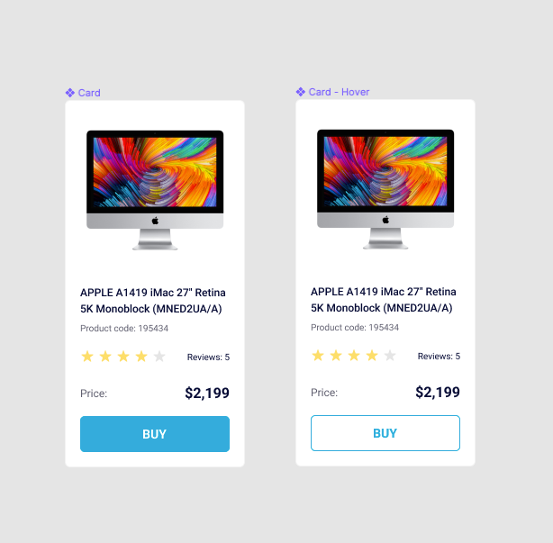

# Product cards
- [DEMO LINK](https://nazarbaraban.github.io/layout_product-cards/)

Created a product card page using flexbox based on the provided mockup. Reset browser default margins, set card width to 200px, and used images from the specified directory. Styled link hover effects as per the mockup, added data-qa="card" attribute to the card block, and data-qa="hover" attribute to the link. Reused the stars block from a previous task, ensuring it functions correctly, and maintained consistency with font styles from the mockup while implementing only two BEM blocks, card and stars, for structural clarity.

---

